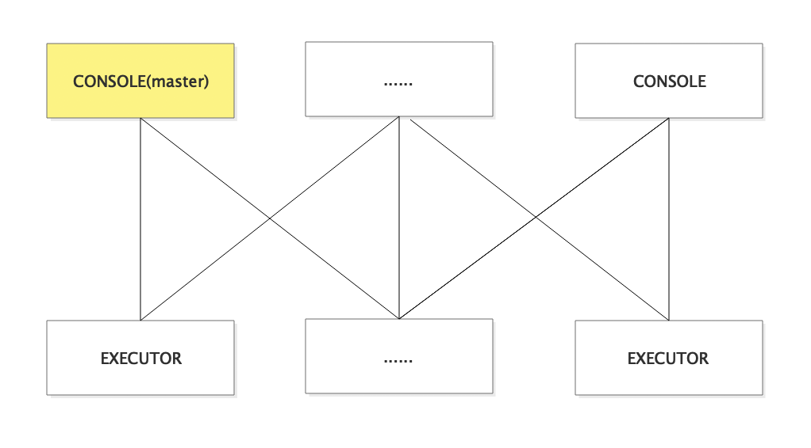

# 项目部署
## 1.介绍
> 开发语言:
>> 后端：JAVA
>> 
>> 前端: react、mobx、antd
>  
> keyword： 调度 / DAG / 任务流 
> 
> 运行环境：
>> jdk: 1.8+
>> 
>> zk: 3.4.8 
>> 
>> redis: 3.0+
>> 
>> mysql: 5.5+

console以及executor都是分布式的


## 2.控制台(CONSOLE) 
```由于console要负责任务调度，只会有一个主来调度分配任务到executor，其他节点是backup；主备之间只有任务调度相关功能区分主备，页面上的操作不区分```
### 1.配置文件，以test为例
```
## http端口
server:
  port: 8080
## 数据源配置
db:
  host: db.liteflow.cn
  port: 3306
  name: lite_flow
  user: lite
  pwd: lite
###redis配置
spring:
  redis:
    host: redis.liteflow.cn
    port: 6379
    password:
    timeout: 100000
    pool:
      maxIdle: 20
      maxActive: 20
      maxWaitMillis: 1000
      testOnBorrow: true

logging:
    config: classpath:config/log4j2-test.xml
# dubbo相关配置
dubbo:
  protocol:
    name: dubbo
    port: 20888
  registry:
    file: /tmp/dubbo.console.cache
  qos:
    port: 33333

zk:
  servers: zk.liteflow.cn:2181
  console:
    leader:
      path: /lite/console/server/leader

```
#### 1.特殊说明下zk相关
```
    zk:
      servers: zk.liteflow.cn:2181
      console:
        leader:
          path: /lite/console/server/leader
```
其中 zk.console.leader.path是console用来选主的节点

### 3.执行者(EXECUTOR)，以test为例
```executor是完全分布式的,没有主备之分```

```
server:
  port: 8081
## 数据源配置
db:
  host: db.liteflow.cn
  port: 3306
  name: lite_flow
  user: lite
  pwd: lite

logging:
    config: classpath:config/log4j2-test.xml

dubbo:
  registry:
    file:  /tmp/dubbo.executor.cache
  protocol:
    name: dubbo
    port: 20880
  qos:
    port: 22222

zk:
  servers: zk.liteflow.cn:2181

#运行空间
lite:
  flow:
    executor:
      workspace: /tmp/lite/executor
      isAutoRegisterToDB: true

```
#### 1.lite.flow.executor.workspace说明
该配置为一个文件夹路径，用来存在一些任务运行的日志和配置信息，所以一定要保证配置的路径，启动项目的linux用户有权限，否则会影响使用

#### 1.lite.flow.executor.isAutoRegisterToDB说明
该配置为执行者信息是否可以自动注册到db中，执行者的信息会关联执行任务，所以很重要；默认开启，如果关闭后，为注册的执行者启动时会报错